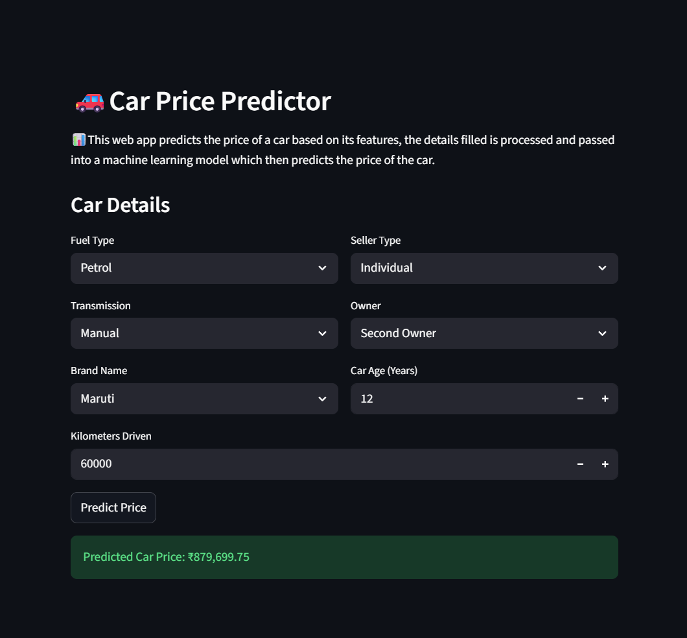

# 🚗 Car Price Prediction App

A machine learning web application that predicts car prices based on various features using XGBoost regression model.

## 📊 Project Overview

This project demonstrates an end-to-end machine learning pipeline:
- Data preprocessing and feature engineering
- Model training and evaluation  
- Web application using Streamlit
- Real-time car price predictions

## 🎯 Features

- **Interactive Web Interface**: User-friendly form to input car details
- **Multiple Car Attributes**: 
  - Brand, Fuel Type, Transmission
  - Kilometers Driven, Car Age
  - Owner History, Seller Type
- **Real-time Predictions**: Instant price estimates
- **Machine Learning Model**: XGBoost regressor with 82% accuracy

## 🛠️ Tech Stack

- **Machine Learning**: Scikit-learn, XGBoost
- **Web Framework**: Streamlit
- **Data Processing**: Pandas, NumPy
- **Preprocessing**: StandardScaler, OrdinalEncoder, OneHotEncoder

## 📈 Model Performance

- **R² Score**: 0.8198
- **RMSE**: 0.3526
- **MAE**: 0.2647
